# **chatGPT openAI api**

# **充值指南（保姆级图文教程）**

#
加V可手把手教学。

# **更新于：**

# **2023/04/17**

**一，准备工作**

**1.\*\*** 请先确保您的 \***\*VPN\*\*** 地址保持在国外，香港台湾都不行，\*\*

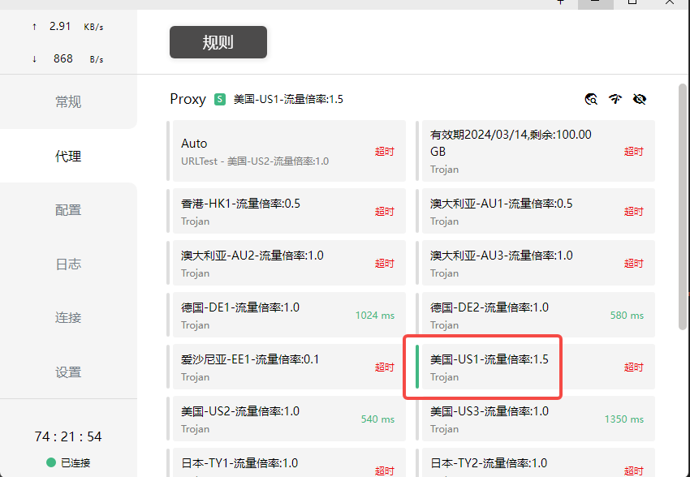

**2.\*\*** 提前查看 \***\*VPN\*\*** 的 \***\*ip\*\*** 地址，后面绑定要用（搜索： \***\*Google\*\*** ： 我的 \***\*IP\*\*** 地址）\*\*

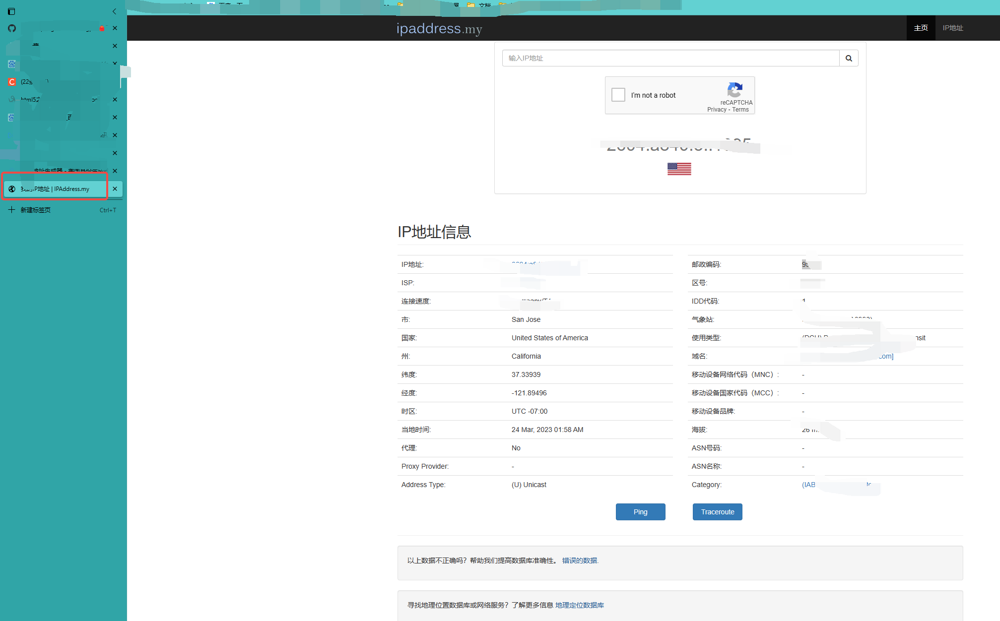

**二，充值过程（使用\*\*** depay \***\*钱包申请万事达卡（\*\*** master \***\*））**

1.下载 depay 钱包 app,下载地址： **https://depay.depay.one/web-app/register-h5?invitCode=921531&lang=zh-cn** ，建议使用手机打开页面，并使用安卓版本，为什么？ **因为方便啊，我用的安卓下载的。**

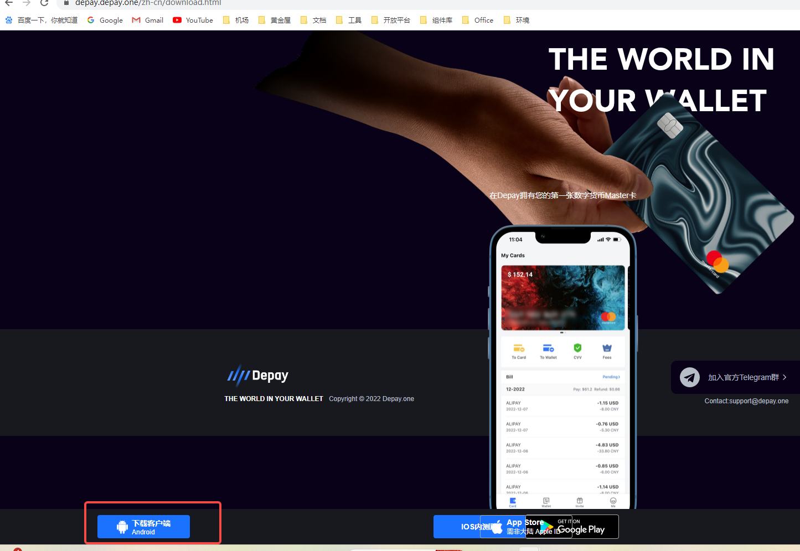

打开链接之后先注册，邮箱电话都行，随意，注册成功后是这样子，然后下载对应版本，以下以安卓版本为例

2.下载完成后打开 depay APP

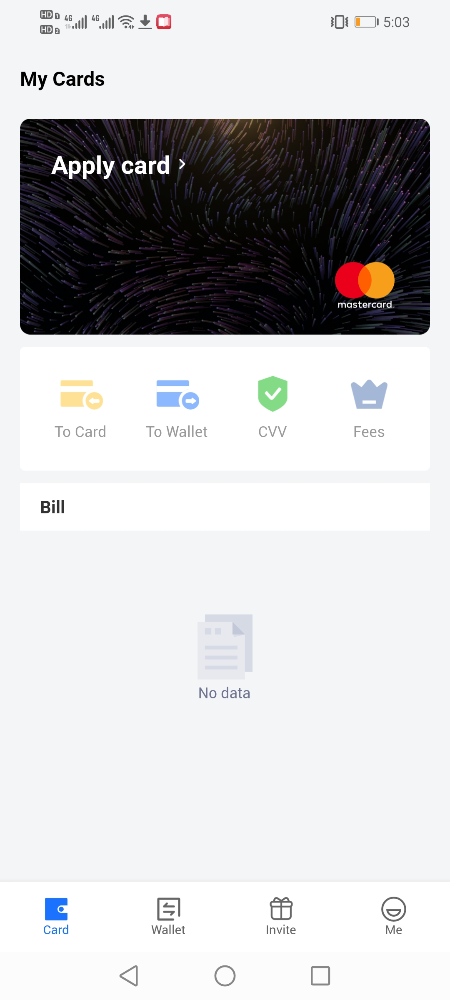

先登录，登录就用你注册时候的方式进行登录，登陆成功后，点击申请卡片（Apply card），我们这里申请的是万事达卡，出现如下

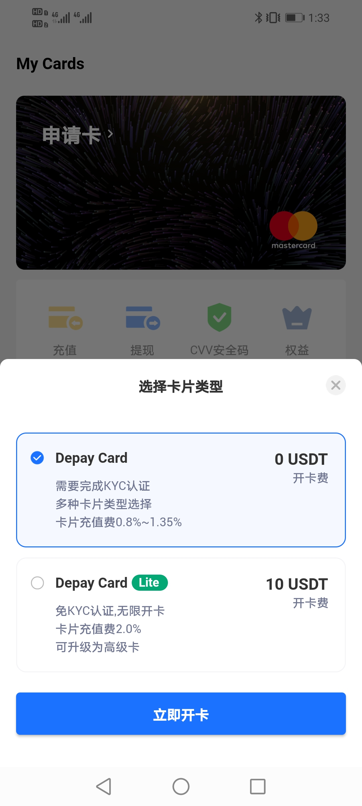

有两种选择，第一种免开卡费，但是需要进行 KYC 验证（就是验证身份），第二种需要 10USDT 的开发费，但是是免认证的，这里，我们账户要是没有 USDT 就直接选择第一种就行，点击立即开卡，

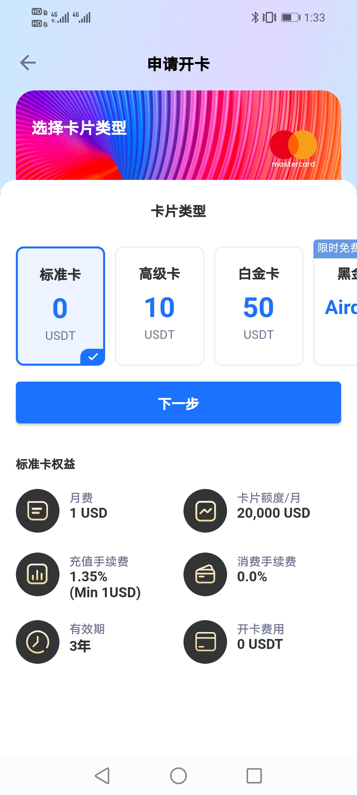

以上是卡类型，每一个类型下面都有具体的说明，我就不赘述了，按照自己的需求，我选择的第一种，点击下一步

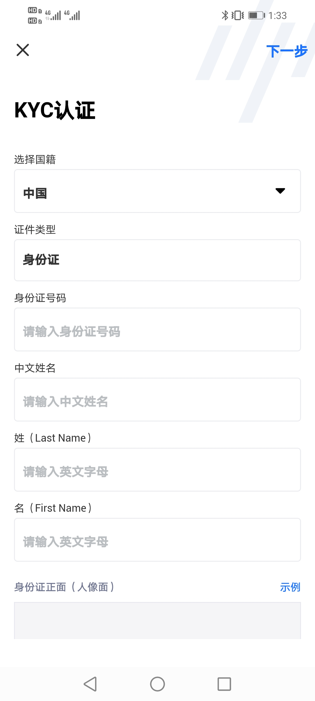

这个是认证，选择中国，然后填写对应信息，最后点击提交，提交后还会有一个视频验证，就是让你读一串数字，这个你们应该之前在哪做过这个动作，大差不差，这个认证完成后，等待几分钟，你就会有有一张属于自己的万事达卡了，这个时候你的卡片应该是这样子

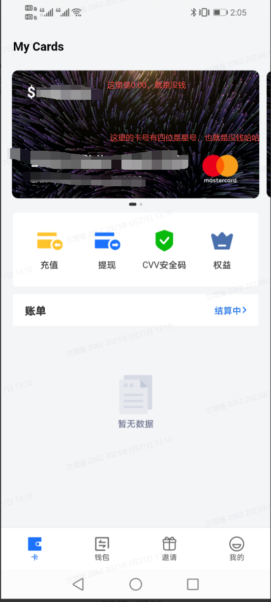

接下来，我们需要做的就是给我们的 depay 钱包里的 USDT 账号充值 U，如下，

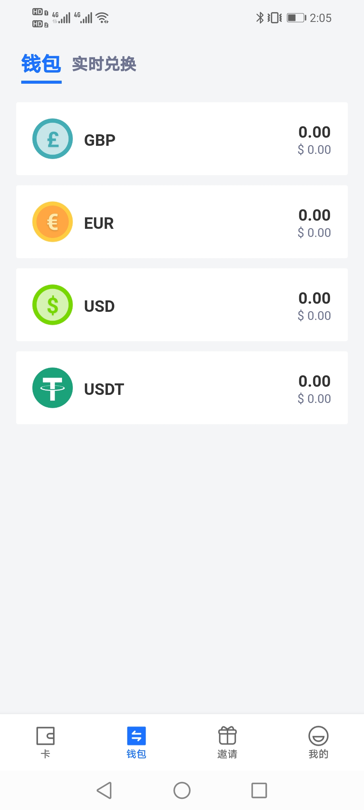

点击 USDT（其他的虚拟币也可以，我用的 USDT）出现如下画面：

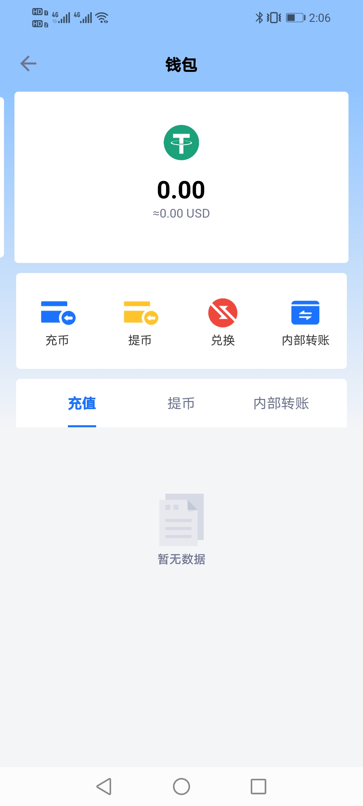

点击充币，选择 TRC20，

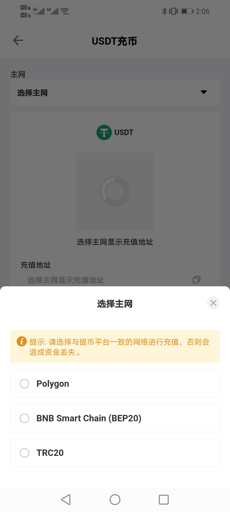

出现如下画面，点击复制地址，将这个地址发给给你账户充值的那位朋友，或者你自己有 USDT 在其他账户的话，这里我的操作是，让我朋友给我转了 500U，到我的账户，如果你自己没有，那你可以找其他人给你账户充值，找我也可以哈哈（500U起充），但是要确保保险的人，

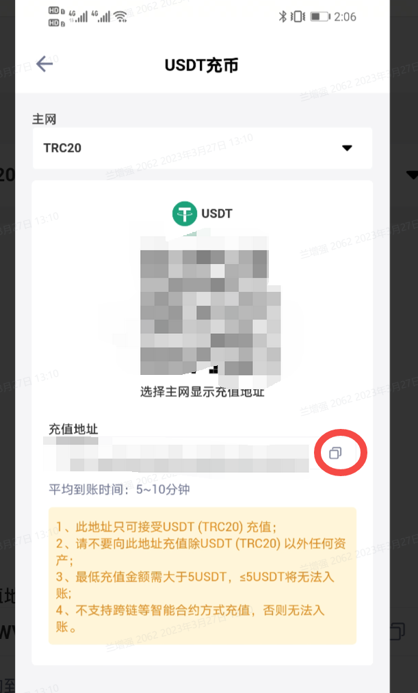

此时，当别人拿到你的地址，给你充值之后，你的账户在等待几分钟后是这样子的（我的已经提现了，目前没 U）：成功后 USDT 后面就会是账户的 U 数量，我当时冲了 500 个，后面就显示 500，这个不难理解哈，

继续，接下来要做的是将这个 U 转到我们的申请 的万事达卡的这个账户上，有点绕是吧，没办法，就是需要一步步转换，遵守规则么，好的，那怎么转换呢？点击实时兑换，

就会出现

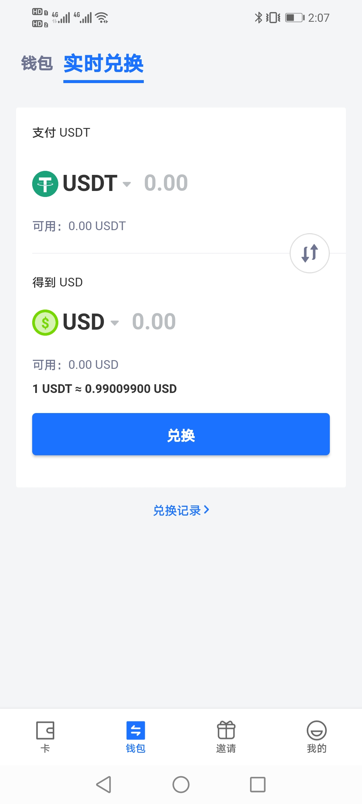

在这里把 U 兑换成 USD，我这里没有 U 你就当我这里有 500 个哈，我选择全部兑换，选择好之后点击兑换，这个上面的单位不用再次选择，就是 USDT--》USD，没有问题的哈，点击兑换之后，会有一个转入钱包，点击全部转入钱包，此时，回到你的钱包首页，你就会看到钱包余额有钱了（这个钱数会有一点点的出入，因为汇率和手续费的原因，一点点，可以忽略不计）而且，卡号信息什么的都显示了出来，就像这样：

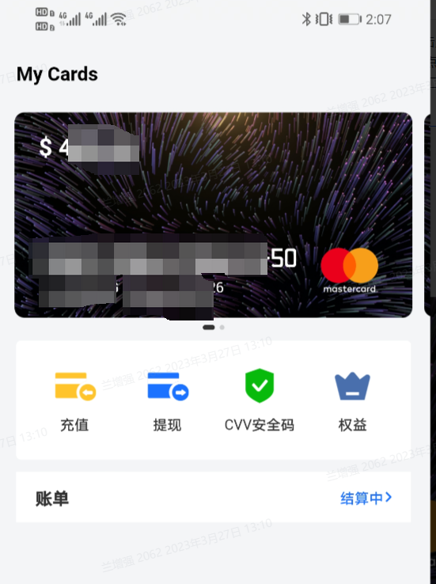

此时此刻，你已经成功了一大半，加油，还有最后一点点了

**三，绑定过程**

1.打开 openAi 主页前请保证你的 VPN 在美国并且稳定，

2.打开 openAI 主页选择 billing 菜单，点击这里的 setup 账户（因为我已经绑定了，所以这里显示的取消账户，没有绑定就会显示 setup，你点击他就行，），

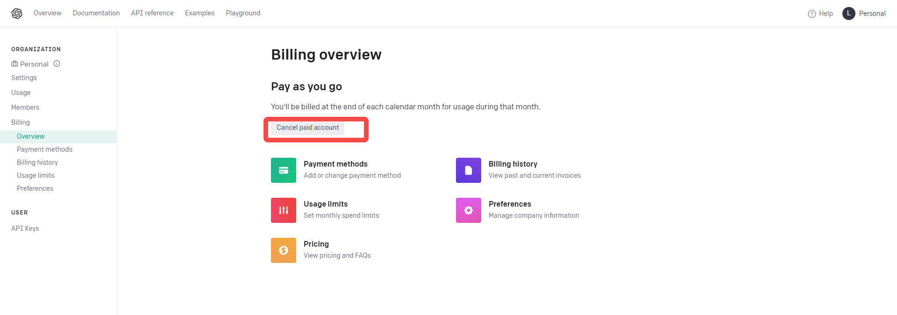

3.点击之后会让你选择个人还是公司，我选的个人，简单点，长这样

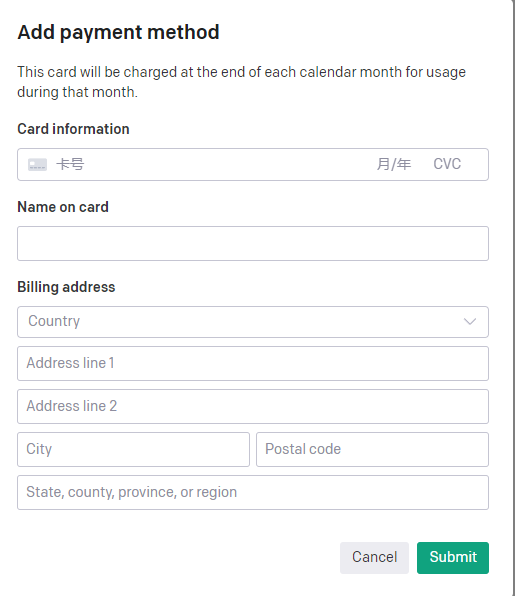

在这里填写你的账户，卡号卡的有效期，这些信息全在你的 depay 上面，CVC 也是，depay 卡片下有一个 CVV 安全，点击查看即可，在这里重点强调，billing address 填写的时候城市以及州，还有邮编，都需要你填写我们准备工作里面强调的地址（就是你 vpn 的 IP 所在地），地址 address line1 去填写你对应 ip 地址的一个随机地址：

举个栗子： 我的 vpn 地址在美国的加利福尼亚州，邮编这些我都可以通过 ip 地址看到 addressline1 就去 Google 搜索美国地址生成器，随机生成的时候选择加利福尼亚州，像这样：

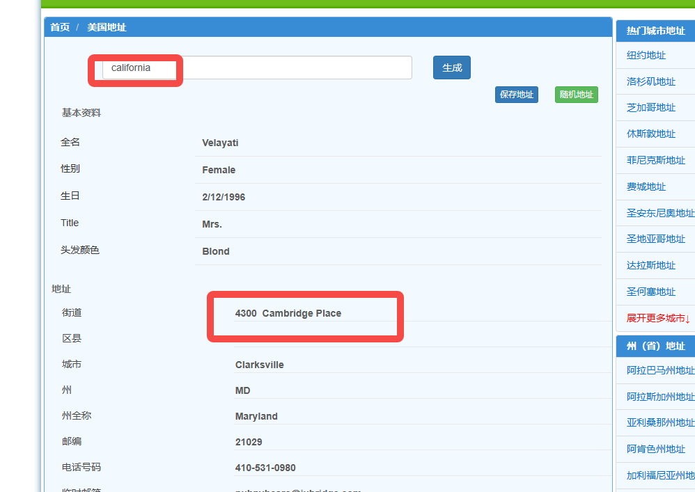

把下面那个地址填上去就好了，填写完信息之后，点击提交，等待系统提示，绑定成功，至此，整个充值绑定的操作就结束了，绑定成功后你的 usage 里面应该显示成这个样子：

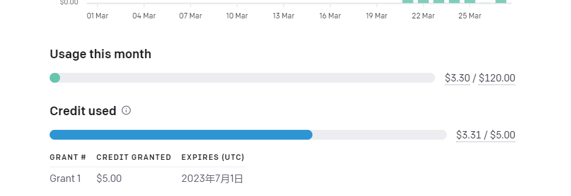

下面那个是免费额度，上面是每个月的限制额度 120$,如果你觉得这个 120 不够用，你可以申请升高月使用额度到你想要的额度范围，包括你可以选择到那个范围给你报告余额不足等等，目前看整个 openAI 的账户使用，是在一个月的某一天统一结算费用，并不是实时扣除的，后续账单出来我们再研究，此时此刻，你就可以放肆的使用 openAI 的开放 api 了，

如果以上内容对你有所帮助，请记得打赏小编喝个奶茶哦！有问题及时 cue 我，

